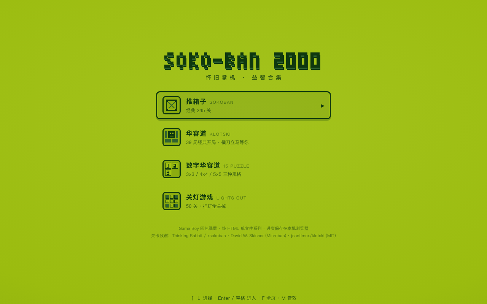
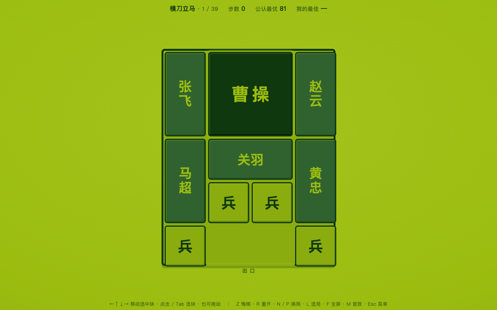

# SOKO-BAN 2000 · 怀旧掌机益智合集

复古 Game Boy 绿屏像素风的益智小游戏合集。每个游戏都是纯 HTML 单文件，无依赖、无构建，双击即玩。

**▶ 在线游玩：<https://oriys.github.io/box/>**

打开就是掌机菜单：↑↓ 选择游戏，Enter 进入，游戏内 Esc 随时回菜单。所有进度保存在浏览器 localStorage。

## 收录游戏

| 游戏 | 内容 | 直达 |
|---|---|---|
| **推箱子** SOKOBAN | 经典 245 关：原版 50 + 隐藏附加 40 + Microban 155，带地图缩略图选关 | [sokoban.html](https://oriys.github.io/box/sokoban.html) |
| **华容道** KLOTSKI | 39 局经典开局（横刀立马、水泄不通…），全部经 BFS 验证可解，显示公认最优步数 | [klotski.html](https://oriys.github.io/box/klotski.html) |
| **数字华容道** 15 PUZZLE | 3×3 / 4×4 / 5×5 三种规格，随机游走打乱保证有解，计步计时 | [fifteen.html](https://oriys.github.io/box/fifteen.html) |
| **关灯游戏** LIGHTS OUT | 50 关渐进难度，确定性生成、保证可解，显示目标按数 | [lightsout.html](https://oriys.github.io/box/lightsout.html) |

## 通用按键

| 按键 | 功能 |
|---|---|
| 方向键 / WASD | 移动 / 滑动 / 光标 |
| Z（或 U / 退格） | 撤销 |
| R | 重开本关 |
| N / P | 下一关 / 上一关 |
| L | 选关面板 |
| F | 浏览器全屏 |
| M | 静音（各游戏共享） |
| Esc | 返回掌机菜单 |

推箱子支持触屏滑动，华容道支持鼠标/触屏拖块，数字华容道和关灯支持点击。

## 技术与致谢

像素画、位图字体、音效（WebAudio 方波）全部由代码生成，无任何外部资源。

- 推箱子原版 90 关：Thinking Rabbit（今林宏行，1982），数据取自 Cornell xsokoban 3.3c，版权归原作者，仅作学习怀旧用途
- Microban 155 关：David W. Skinner，作者允许自由分发
- 华容道 39 局布局数据：[jeantimex/klotski](https://github.com/jeantimex/klotski)（MIT License）
